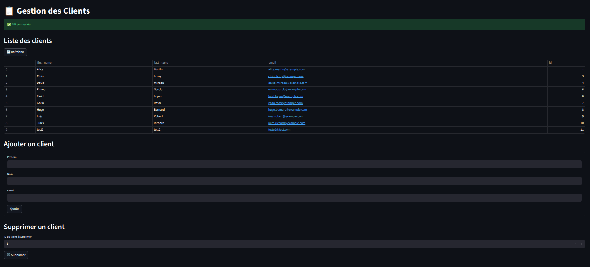

# Brief Kubernetes

## Présentation

Ce projet est une **initiation à  Kubernetes en local** qui permet de déployer et tester des applications et services en environnement Minikube.  
L'objectif est de se familiariser avec Kubernetes, les déploiements, services, ConfigMaps, Secrets et Ingress en local.

---

## Prérequis

Avant de commencer, assurez-vous d'avoir installé sur votre machine :

- [Docker](https://www.docker.com/)  
- [Minikube](https://minikube.sigs.k8s.io/docs/start/)  
- [kubectl](https://kubernetes.io/docs/tasks/tools/)  

Vérification rapide :
```bash
docker --version
minikube version
kubectl version --client
```

## Installation est démarrage

Aprés avoir cloner ce répo, déplacez vous dans le dossier **k8s** puis dans votre terminal :

1. Démarrer Minikube
```bash
minikube start
```

2. Vérifier le bon fonctionnement de Minikube
```bash
kubectl get nodes
```

3. Activer Ingress
```bash
minikube addons enable ingress
```

4. Créer un namespace
```bash
kubectl apply -f manifests/namespace.yaml
```
5. Configurer le namespace par défaut
```bash
ubectl config set-context --current --namespace=dai-simplon

# Puis vérifier votre configuration
kubectl config get-contexts
```
Avant de déployer les ressources, configurer le fihcier hosts en suiavant les les étapes suivantes :

```bash
# Récupérer l'IP de votre clusteur Minikube avec la commande suivante
minikube ip
# Puis ajouter la ligne suivante dans le fichier /etc/hosts
# 192.168.49.2    streamlit.local
sudo nano /etc/hosts
# CTR+O pour enregistrer  & CTRL+X pour quitter nano
```

6. Déployer les ressources Kubernetes
```bash
kubectl apply -R -f manifests/

# Puis vérifier si les pods sont en fonctionnement
kubectl get pods -n dai-simplon
```
7. Dans votre navigateur préféré accéder au backend
[http://streamlit.local/](http://streamlit.local/) 

## Backend


